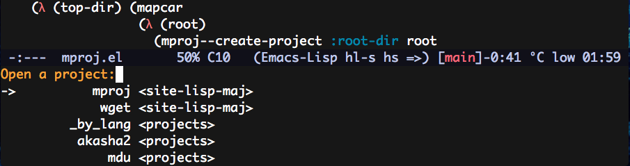

# Mproj.el

Its a mini project managment tool for easy selection and opening of
projects via minibuffer.

<p align="center">
  
</p>


## Usage

Give it a list of directories containing projects in it's
subdirectories at most 1 level deep and your done. The variable in question
is `mproj-projects-dirs-list`

```el
(setq mproj-projects-dirs-list
      '("~/.emacs.d/site-lisp-maj/"
        "~/dev/projects"))
```

After that get the project list in the minibuffer via `M-x`
`mproj/open-project`.

For now only a static action is invoked after the project selection,
that resumes to open the project root in dired. That can be changed in
`mproj-default-action` and for example make it open the project in
`perspective-mode`.

```el
(require 'perspective)

(setq mproj-default-action
      (lambda (proj)
        (let* ((name (mproj-project-name proj))
               (first-time? (not (gethash name perspectives-hash)))
               (current-perspective persp-curr))
          (persp-switch name)
          (setq persp-last current-perspective)
          (if (and first-time? (mproj-project-root proj))
              (find-file (mproj-project-root proj)))))
```

## License

Copyright © 2017 Pedro Major <pedro.major@gmail.com>
